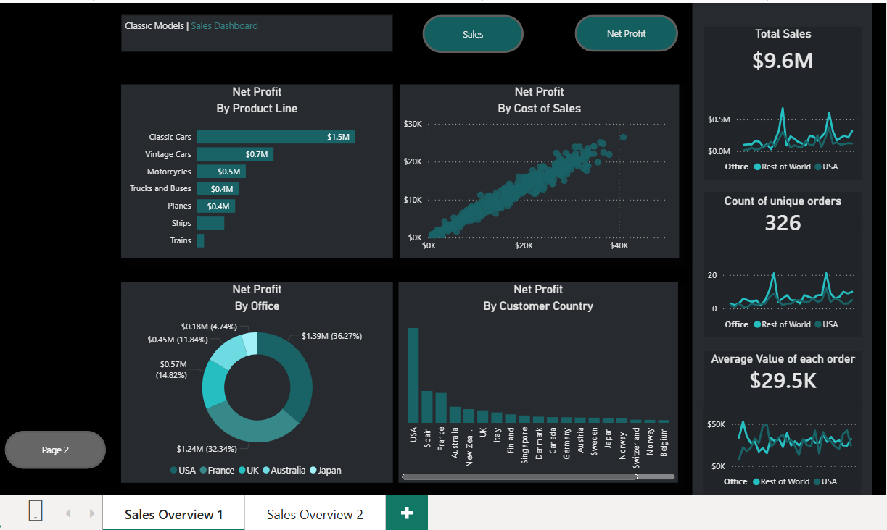
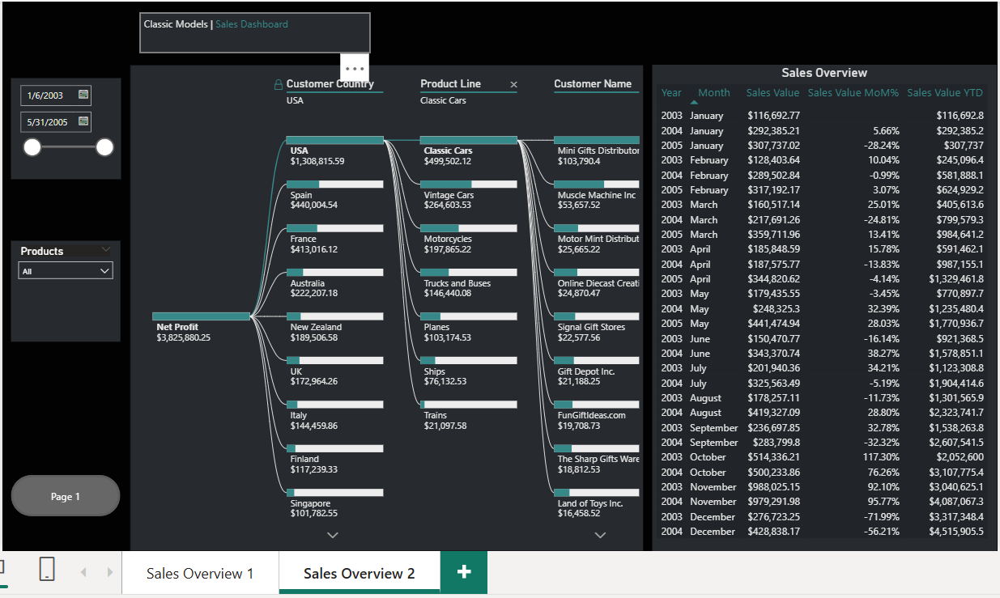

# Sales Performance & Profit Analytics Dashboard

## Project Overview

Developed an interactive Power BI dashboard using the Classic Models dataset to analyze sales performance, profitability, customer behavior, and product line trends. The dashboard enables users to monitor key business KPIs and perform detailed sales analysis through interactive visualizations.

## Business Objective

- Analyze sales and profit performance across products and customers.
- Identify top-performing product lines and regions.
- Track sales trends and profitability metrics.
- Support business decision-making through interactive reporting.

## Tools & Technologies

- Power BI
- Power Query
- DAX
- Data Modeling
- Microsoft Excel

## Key Metrics

- Total Sales
- Net Profit
- Average Order Value
- Unique Orders
- Sales Growth Trends
- Product Line Profitability

## Dashboard Features

### Sales Performance Analysis

- KPI Cards for Sales, Profit, Orders, and Average Order Value
- Product Line Profitability Analysis
- Customer Country Analysis
- Profit Distribution by Office
- Interactive Filters and Slicers

### Advanced Analytics

- Decomposition Tree Analysis
- Customer-Level Profit Analysis
- Product Line Drill-Down Analysis
- Month-over-Month Sales Tracking
- Year-to-Date Sales Analysis

## Dashboard Screenshots

### Sales Performance Dashboard

### Sales Decomposition Tree Analysis

## Business Insights

- Classic Cars generated the highest overall profit among product lines.
- USA contributed the largest share of customer profitability.
- Sales trends highlighted key growth opportunities across customer segments and product categories.
- Decomposition Tree analysis enabled detailed drill-down into profit drivers by country, product line, and customer.

---

## Files Included

- Sales_Performance_Analytics_Dashboard.pbix
- 01_Sales_Overview.png
- 02_Sales_Overview.png
- README.md

---

## Author

**Akash Shrivastava**
Microsoft PL-300 Certified Power BI Data Analyst

Skills: Power BI, SQL, PostgreSQL, Python, Excel, DAX, Power Query, Data Modeling
